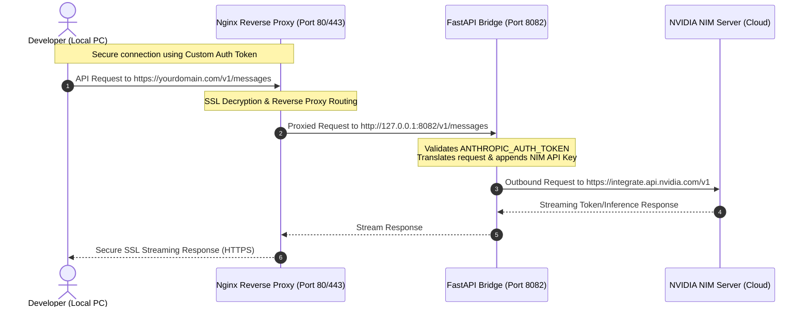

# Remote-NIM-Setup ⚡
> **Automated Remote NVIDIA NIM Server Deployment & Secure Nginx Reverse Proxy Orchestrator**

[](https://ubuntu.com/)
[](LICENSE)
[](https://docs.python.org/3.14/)
[](https://astral.sh/uv)
[](https://nginx.org/)
[](https://letsencrypt.org/)

`Remote-NIM-Setup` is a premium, fully-automated bash bootstrapper designed to deploy a secure, high-performance, and persistent **NVIDIA NIM-compatible FastAPI server bridge** on any cloud VM (AWS EC2, Azure VM, Google Compute Engine, or generic VPS).

It consolidates all system dependencies, **uv package manager**, **Python 3.14**, **systemd**, **Nginx reverse proxying**, and **Certbot (Let's Encrypt SSL/HTTPS)** into a single, interactive, and beautifully styled CLI installer.

---

## 🗺️ System Architecture

The following diagram illustrates how your local coding assistant clients connect securely to your remote VM, which then proxies requests to the high-performance NVIDIA NIM API endpoints:



---

## 🌟 Key Features

* 🚀 **Single-Line Bootstrap:** Performs system audits, package upgrades, virtual environment provisioning, and starts background services in seconds.
* 📦 **UV & Python 3.14 Native:** Utilizes Astral's lightning-fast `uv` package manager to fetch, build, and run the FastAPI server on a modern **Python 3.14** engine.
* 🛡️ **Personal Auth Protection:** Prompts you to set a custom token (`ANTHROPIC_AUTH_TOKEN`) to prevent unauthorized public access to your remote proxy bridge.
* 🧩 **Robust Input Sanitizer:** Cleverly sanitizes domain inputs. Whether you enter `https://api.yourdomain.com`, `www.yourdomain.com`, or `api.yourdomain.com:8080/`, it extracts `api.yourdomain.com` cleanly, avoiding Certbot or Nginx crashes.
* 📡 **Public IP Safeguards:** Detects your VM's public IP dynamically using `api.ipify.org` and warns you if it's dynamic (recommending Static/Elastic IPs) while offering a manual override.
* 🔗 **Nginx Reverse Proxy:** Configures Nginx to map standard incoming Port 80/443 traffic directly to the local FastAPI server.
* 🔄 **Resilient Non-Fatal SSL Setup:** Certbot validation errors are handled gracefully. If Port 80 is blocked or DNS isn't fully propagated, it falls back to standard HTTP and prints an action plan, rather than terminating.
* 💡 **Client Integration Hub:** Displays pre-populated config templates at the end of the script for **Claude Code CLI**, **Cline**, **Roo Code**, **Continue**, and **Cursor**.

---

## 📋 Pre-Requisites

To guarantee a flawless setup, configure these cloud and network parameters before running the script:

### 1. Cloud Firewall / Security Group Settings
Ensure the following Inbound Rules are active in your cloud console (AWS Security Groups, Azure NSGs, or GCP Firewall Rules):

| Protocol | Port | Source | Purpose | Required For |
| :--- | :--- | :--- | :--- | :--- |
| **TCP** | `80` | `0.0.0.0/0` | HTTP Traffic | Certbot SSL Domain Verification |
| **TCP** | `443` | `0.0.0.0/0` | HTTPS Traffic | Secure Client API Interactions |
| **TCP** | `8082` | `0.0.0.0/0` | Direct Server Port | Direct HTTP testing *(Disable after Nginx works)* |

### 2. DNS Configuration
Create a DNS `A` record pointing your domain or subdomain to your VM's Public/Elastic IP:

```text
A   api.yourdomain.com   ➔   YOUR_VM_PUBLIC_IP
```
*Note: Make sure DNS propagation has finished before starting the installation by running `ping api.yourdomain.com` locally.*

### 3. API Keys & Credentials
1. **NVIDIA NIM API Key:** Procure a free API key with complimentary credits by signing up on the [NVIDIA Build Console](https://build.nvidia.com/settings/api-keys).
2. **Custom Auth Token:** Choose a highly secure custom token (e.g. `my-private-nim-key-99!`) to restrict access to your proxy.

---

## 🚀 Quick Start (Installation)

Connect to your remote VM via SSH and execute the installer:

```bash
curl -sL https://raw.githubusercontent.com/gshuvam/Remote-NIM-Setup/main/setup.sh | bash
```

> [!TIP]
> **Bypass GitHub CDN Cache:**
> GitHub's Raw CDN caches scripts for up to 5 minutes. If you've recently modified `setup.sh` and need to execute it on the VM immediately, force-bypass the cache by appending a random Unix timestamp query string:
> ```bash
> curl -sL "https://raw.githubusercontent.com/gshuvam/Remote-NIM-Setup/main/setup.sh?v=$(date +%s)" | bash
> ```

---

## 🛠️ Developer Client Integration Guides

Once the script completes, connect your local coding assistant tools using the following configurations. 

*(Replace `yourdomain.com` with your domain/subdomain, and `your_custom_auth_token` with your secure custom token.)*

### 1. Claude Code CLI (Official Anthropic CLI)
Set these environment variables in your terminal session before starting Claude Code:

```bash
export ANTHROPIC_BASE_URL="https://yourdomain.com"
export ANTHROPIC_AUTH_TOKEN="your_custom_auth_token"
claude
```

> [!TIP]
> **Make It Permanent:**
> Add these export lines to your local shell config file (e.g. `~/.bashrc`, `~/.zshrc`, or `~/.config/fish/config.fish`) to avoid re-exporting them on every terminal session:
> ```bash
> echo 'export ANTHROPIC_BASE_URL="https://yourdomain.com"' >> ~/.zshrc
> echo 'export ANTHROPIC_AUTH_TOKEN="your_custom_auth_token"' >> ~/.zshrc
> source ~/.zshrc
> ```

---

### 2. VS Code Extensions (Cline / Roo Code)
Configure the extension settings in your VS Code sidebar:

* **API Provider:** `Anthropic` or `Custom OpenAI-compatible`
* **Base URL:** `https://yourdomain.com`
* **API Key:** `your_custom_auth_token`
* **Model ID:** `claude-3-5-sonnet-20241022`

---

### 3. VS Code Continue Extension
Append this model configuration within your local `~/.continue/config.json` file inside the `models` array:

```json
{
  "models": [
    {
      "title": "Remote NVIDIA NIM",
      "provider": "openai",
      "apiBase": "https://yourdomain.com/v1",
      "apiKey": "your_custom_auth_token",
      "model": "claude-3-5-sonnet-20241022"
    }
  ]
}
```

---

### 4. Cursor Editor
1. Open Cursor and navigate to **Cursor Settings ➔ Models ➔ OpenAI-Compatible**.
2. Enable the feature and configure:
   * **Endpoint URL:** `https://yourdomain.com/v1`
   * **API Key:** `your_custom_auth_token`
3. Click "Save" and select your custom model.

## 🔒 Secure Admin Dashboard Access

The proxy server includes a powerful local **Admin UI** (located internally at `http://127.0.0.1:8082/admin`) to inspect connections, view active logging streams, and update NIM models or provider settings.

To protect your API keys and server configuration, the reverse proxy **securely blocks all public `/admin` requests** (returning a `403 Forbidden` status).

To access the configuration dashboard safely:
1. Establish a secure **SSH Port Forwarding Tunnel** to your VM:
   ```bash
   ssh -L 8082:localhost:8082 user@your_vm_ip
   ```
2. Open your local web browser and navigate to:
   ```text
   http://127.0.0.1:8082/admin
   ```
This forwards your local browser requests securely over the encrypted SSH session directly to the loopback address on the VM.

---

## ⚙️ Service Maintenance & Diagnostics

All system processes are isolated, managed via `systemd`, and proxied under `nginx`. Use these operations on your remote VM for management:

### 🔍 Service Diagnostics

* **Inspect Application Health:**
  ```bash
  sudo systemctl status nvidia-nim
  ```
* **Stream Live Server Logs:**
  ```bash
  sudo journalctl -u nvidia-nim -f
  ```
* **Verify Listening Ports:**
  Ensure the FastAPI server is listening internally on port `8082`:
  ```bash
  sudo ss -tulpn | grep 8082
  ```

### 🔄 Restart & Management

* **Restart Application Server:**
  ```bash
  sudo systemctl restart nvidia-nim
  ```
* **Restart Nginx Reverse Proxy:**
  ```bash
  sudo systemctl restart nginx
  ```
* **Reboot VM & Verify Persistence:**
  The service is registered to persist and launch automatically on VM reboots. Test this by running:
  ```bash
  sudo reboot
  ```

---

## 🔧 Troubleshooting Guide

### 1. Certbot SSL Authentication Failures (HTTP-01)
If the installation script reported an SSL error, the reverse proxy falls back to HTTP-only mode on port 80. This is typically caused by:
* **Closed Port 80:** Check AWS Security Groups/Azure NSGs and ensure Inbound Port 80 allows traffic from source `0.0.0.0/0`.
* **DNS Propagation Latency:** The DNS records might not have fully propagated yet.

#### Solution:
Once you ensure Port 80 is open and DNS points to your VM, execute Certbot manually to secure Nginx:
```bash
sudo certbot --nginx -d yourdomain.com
```
This automatically registers the certificate and rewrites the Nginx configuration to force HTTPS redirection.

### 2. "Standard input is not a terminal" Errors
If you are running the script using custom deployment hooks or automated remote SSH pipes (like `ssh user@ip "curl -sL ... | bash"`), standard input (`/dev/stdin`) is captured by the network stream, preventing interactive prompts.

#### Solution:
The installer uses interactive terminal TTY redirection (`< /dev/tty`). If running non-interactively, write your environment keys directly to `.env` in the project directory beforehand:
```env
ANTHROPIC_AUTH_TOKEN="your_custom_auth_token"
NVIDIA_NIM_API_KEY="nvapi-xxx"
```

### 3. Nginx Gateway Timeout (504) or Bad Gateway (502)
* **502 Bad Gateway:** Means the FastAPI backend server is not running or crashed. Check its logs:
  ```bash
  sudo journalctl -u nvidia-nim -n 100 --no-pager
  ```
* **504 Gateway Timeout:** Typically happens when the FastAPI bridge fails to reach NVIDIA's external model API servers. Verify outbound internet connectivity on your VM:
  ```bash
  curl -I https://integrate.api.nvidia.com
  ```

---

## 🧹 Complete Uninstallation / Cleanup

If you need to tear down the server and completely remove all installed assets, run these commands on the VM:

```bash
# 1. Stop and disable systemd service
sudo systemctl stop nvidia-nim
sudo systemctl disable nvidia-nim
sudo rm -f /etc/systemd/system/nvidia-nim.service
sudo systemctl daemon-reload

# 2. Remove Nginx configuration
sudo rm -f /etc/nginx/sites-enabled/nvidia-nim
sudo rm -f /etc/nginx/sites-available/nvidia-nim
sudo systemctl reload nginx

# 3. Revoke SSL certificates (optional)
sudo certbot delete --cert-name yourdomain.com

# 4. Remove project files
rm -rf ~/nvidia-nim
```

---

## 📄 License

This setup utility and the corresponding proxy server are open-source and licensed under the [MIT License](LICENSE).
